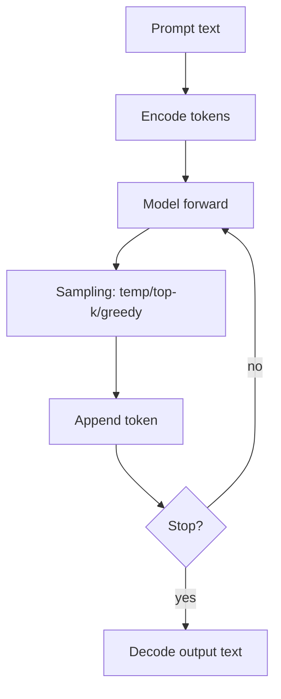

# Generation Flow

```mermaid
flowchart TD
  P[Prompt text] --> E[Encode tokens]
  E --> M[Model forward]
  M --> S[Sampling: temp/top-k/greedy]
  S --> A[Append token]
  A --> T{Stop?}
  T -- no --> M
  T -- yes --> D[Decode output text]
```
