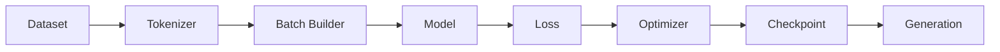

# System Overview

## Pipeline

```mermaid
flowchart LR
  A[Dataset] --> B[Tokenizer]
  B --> C[Batch Builder]
  C --> D[Model]
  D --> E[Loss]
  E --> F[Optimizer]
  F --> G[Checkpoint]
  G --> H[Generation]
```

Notation: `B` batch, `T` sequence length, `C` embedding dim, `H` heads, `V` vocabulary, `L` blocks.
