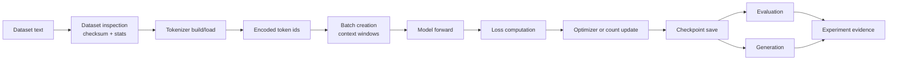

# System Overview

The system is intentionally small and explicit. A text dataset is inspected, tokenized, split into training and validation text, converted into context windows, passed through a baseline or neural model, optimized, checkpointed, evaluated, and used for generation.

## Lifecycle summary

1. Load a clearly identified dataset file.
2. Compute provenance data such as checksum and size.
3. Build or load a tokenizer.
4. Encode text into integer token IDs.
5. Form training examples of length `T` with next-token targets.
6. Run a model that predicts the next token distribution over vocabulary size `V`.
7. Measure negative log likelihood or cross-entropy loss.
8. Save checkpoints with enough metadata to validate compatibility.
9. Evaluate loss and perplexity on held-out data.
10. Generate text autoregressively from a prompt.
