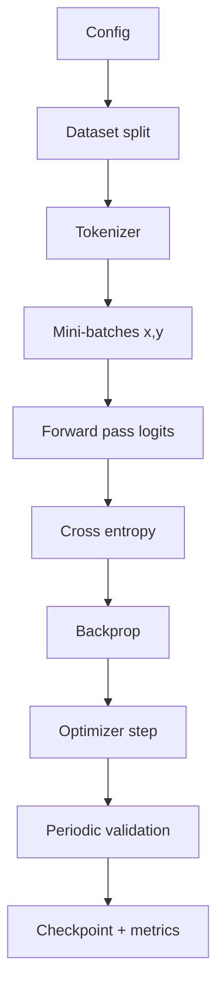

# Training Flow

```mermaid
flowchart TD
  Cfg[Config] --> Data[Dataset split]
  Data --> Tok[Tokenizer]
  Tok --> Batch[Mini-batches x,y]
  Batch --> Fwd[Forward pass logits]
  Fwd --> Loss[Cross entropy]
  Loss --> Bwd[Backprop]
  Bwd --> Step[Optimizer step]
  Step --> Eval[Periodic validation]
  Eval --> Ckpt[Checkpoint + metrics]
```
